# HireMind AI — Where Careers Rise


⚡ **Live Demo:** [https://hire-mind-ai-ud.vercel.app/](https://hire-mind-ai-ud.vercel.app/)

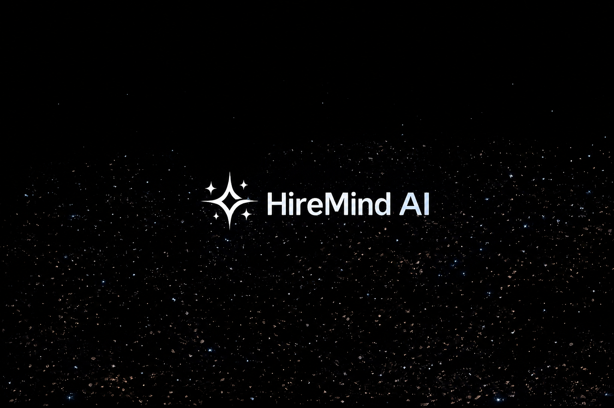

**HireMind AI** is a premium, high-performance, cinematic recruitment ecosystem designed to streamline the career journey for job seekers and scale talent pipelines for companies. By utilizing state-of-the-art server-side integration with **Google Gemini AI**, HireMind parses resumes, checks matching scores, guides applicants with an interactive AI prep coach, and automates recruiter workflows.

---

## 🚀 Key Features

### 👤 For Job Seekers
* **Smart Resume Parser:** Automatically extract technical/soft skills, education, and career experience from your resume document.
* **Automated Job Match:** Review real-time suitability compatibility scores (0-100%) against open vacancies with detailed gap justifications.
* **Interactive Prep Coach:** Chat with a tailored AI interview coach that references your resume history and target job details to prepare you for technical, behavioral, and situational questions.
* **Cover Letter Builder:** Instantly generate bespoke cover letters tailored to your profile and the target job description.

### 💼 For Recruiters & Companies
* **Job Architect:** Auto-generate professional, SEO-friendly job listings from raw drafts or bullet points.
* **AI Candidate Ranking:** View a clean shortlist of top applicants automatically scored and ranked by profile compatibility.
* **Fit Analysis:** Get granular analysis on candidates' missing skills, improvements, and interview preparation points.
* **Sleek Pipeline Tracker:** Manage candidate stages from shortlisted to interviewed and offered in a smooth Kanban-style interface.

---

## 🛠️ Tech Stack

### Frontend
* **Core:** React, TypeScript, Vite
* **Styling:** Custom Vanilla CSS (with sleek dark-mode, glassmorphism, and responsive layouts)
* **API Communication:** Fetch API proxying to secure server-side routes

### Backend
* **Server Runtime:** Node.js, Express
* **Database:** MongoDB Atlas (Mongoose ODM)
* **Authentication:** JWT, Express-Session, and Passport.js (Google OAuth 2.0 & Local verification)
* **AI Engine:** `@google/genai` (utilizing Gemini 2.5 Flash with custom rate-limiting retry policies)

---

## ⚙️ Getting Started & Setup

### 1. Prerequisites
Ensure you have the following installed:
* **Node.js** (v18.x or later)
* **npm** (v9.x or later)
* **MongoDB** (Local instance or MongoDB Atlas Connection URI)

### 2. Installation
Clone the repository and install dependencies for both the frontend and backend:

```bash
# Clone the repository
git clone https://github.com/Utkarshdixit11/HireMind-AI.git
cd HireMind-AI

# Install frontend dependencies
npm install

# Install backend dependencies
cd backend
npm install
```

### 3. Environment Setup (.env)
Create a `.env` file in the `backend` directory and add the following configuration:

```env
PORT=5000
MONGO_URI=your_mongodb_atlas_connection_uri
JWT_SECRET=your_jwt_secret_key
SESSION_SECRET=your_express_session_secret_key

# Google OAuth (Passport) Credentials
GOOGLE_CLIENT_ID=your_google_client_id
GOOGLE_CLIENT_SECRET=your_google_client_secret
CLIENT_URL=http://localhost:5173

# Gemini AI Engine credentials
GEMINI_API_KEY=your_gemini_api_key
```

### 4. Running the Application

#### Start the Backend Server:
```bash
cd backend
npm run dev
# Server will run on http://localhost:5000
```

#### Start the Frontend Client:
```bash
# Navigate back to root
cd ..
npm run dev
# Client will run on http://localhost:5173
```

---

## 📸 Application Showcase

### 1. Home Dashboard & Authentication
Landing page overview with seamless secure Local & Google login overlays.
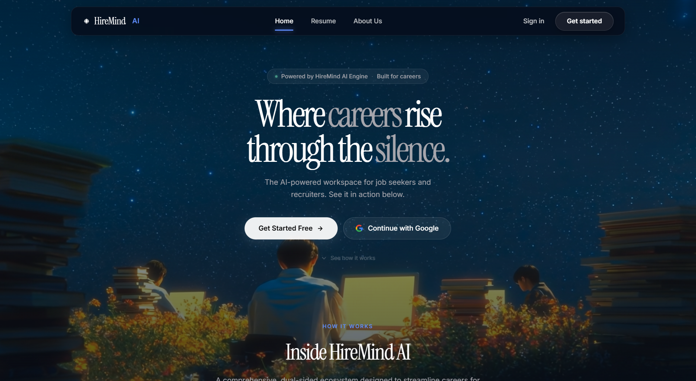
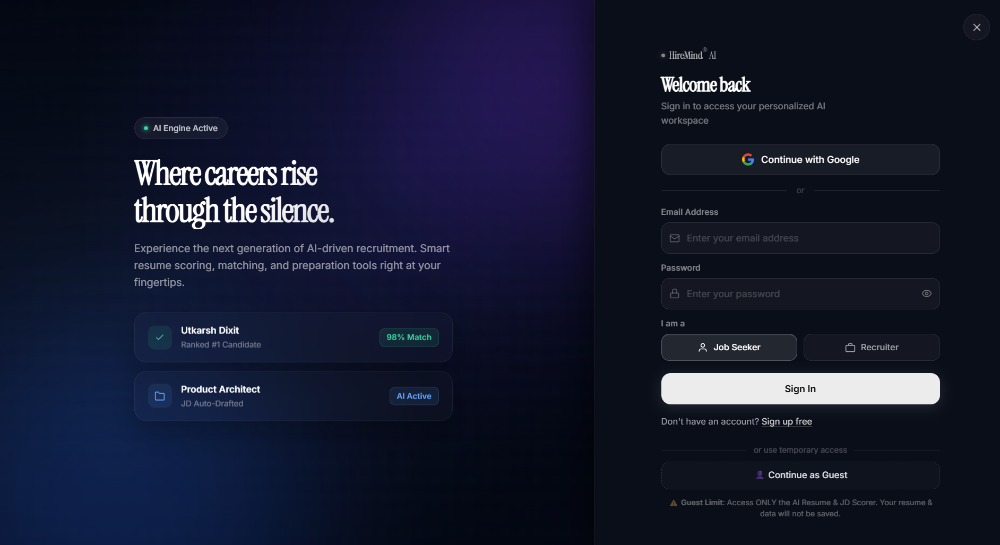

### 2. The Job Seeker Experience
Upload resumes, view suitable listings, check compatibility scores, and prepare with the AI Prep Coach.
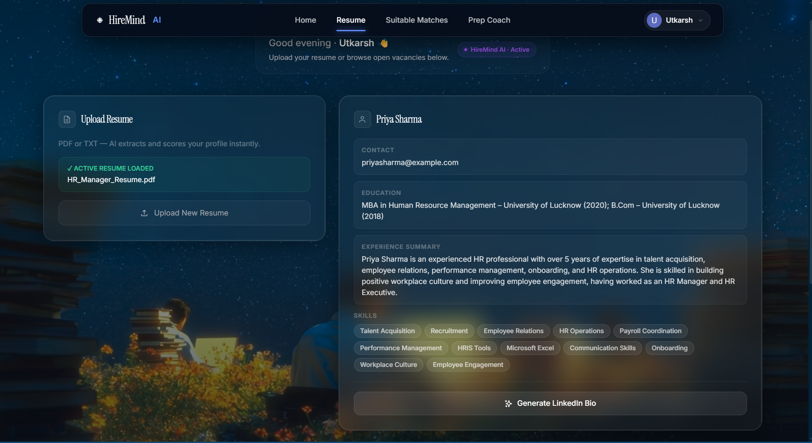
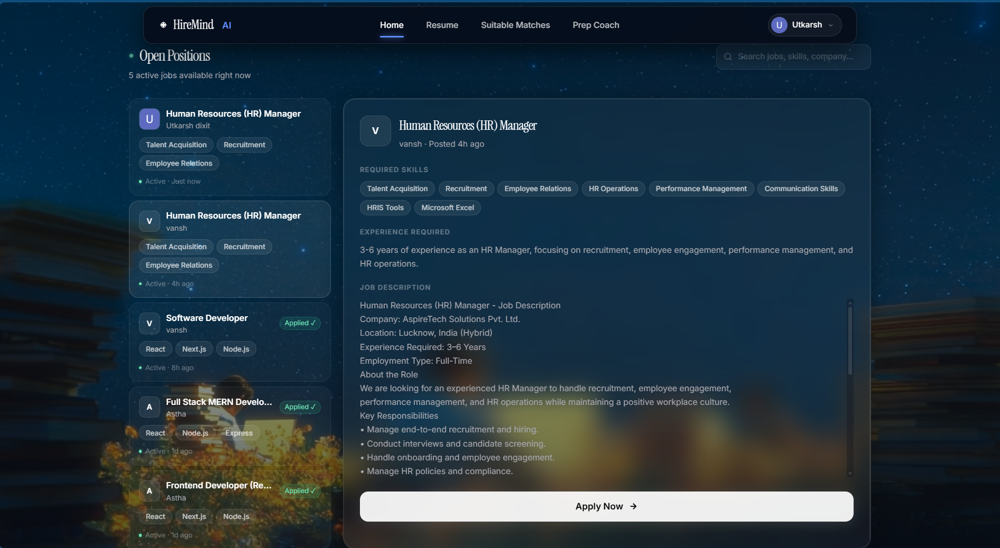
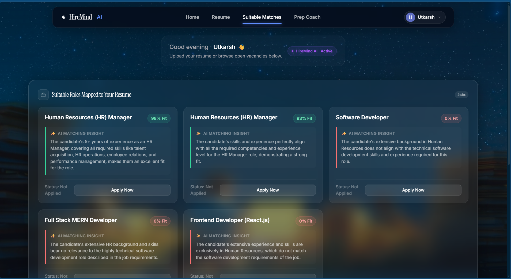
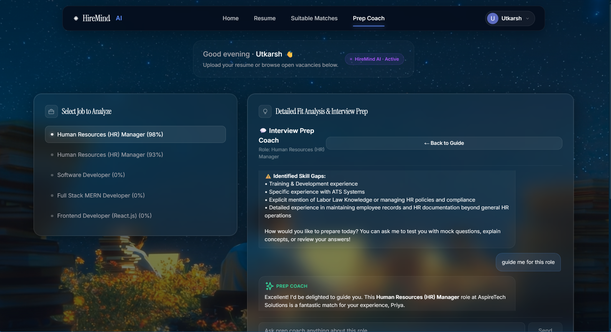

### 3. The Recruiter Workspace
Post new job openings, manage active listings, review candidate rankings, and view fit analyses.
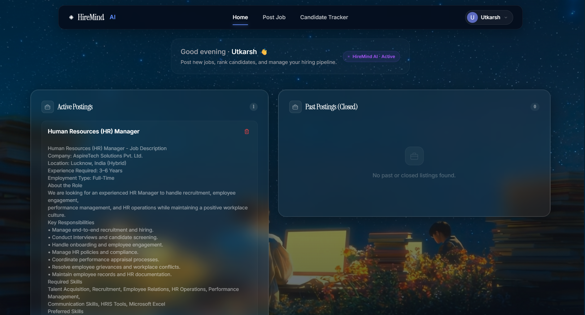
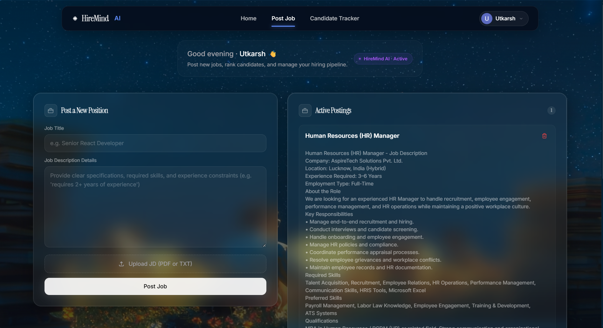
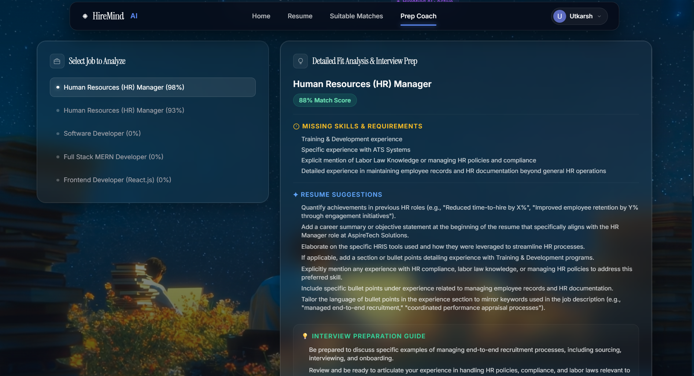
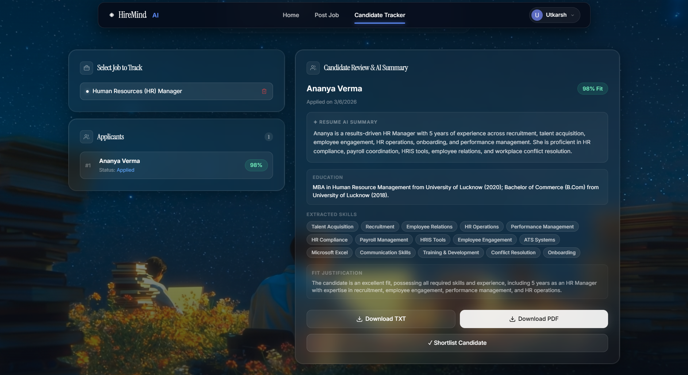

## 📄 License
This project is licensed under the MIT License — see the [LICENSE](./LICENSE) file for details.
